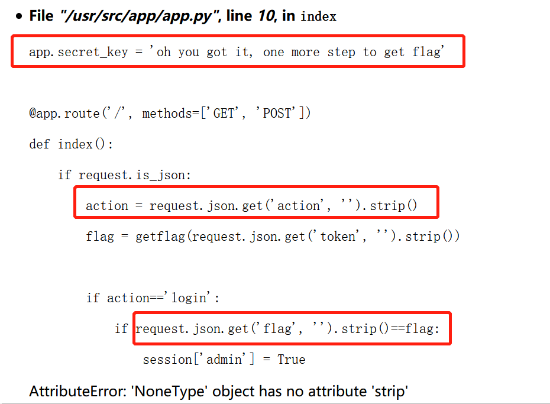

## Misc部分

## 第一题：签到

base64编码，用在线解码工具解出`synt{J3ypbzr gb 0gu CXH ThThTh, rawbl gur tnzr!}`，格式与flag相同，对所有字母移位即可试出正确的flag。

## 第二题：主的替代品

字符串可以通过运算避开连续的`main`字符串，唯一的考点在于改掉主函数的名字，在代码前加入 `#define my m##ain`（两个#用于拼接字符串），用my作为main函数的名字即可。

## 第三题：小北问答

1. > 理科一号楼共有 8 个计算中心机房，其中第 n 机房的门牌号是Xn（1000≤Xn≤9999），求 ∑ (Xn)n 的最大质因数？——108475792463321

   实地考察门牌号+大素数分解

2. > 北京大学的哪门课被称为“讲得好、作业少、考试水、给分高的课”（中文全称）？——穆良柱老师的热学

   在树洞的课程评估页面里藏着

3. > 根据 HTCPCP-TEA 协议，当一个茶壶暂时无法煮咖啡时，应当返回什么状态码？——503

   直接百度

4. > 在 Conway's Game of Life 中，有多少种稳定的由 7 个活细胞构成的局面？稳定是指每个时刻的状态都与初始状态完全相同。旋转或对称后相同的视为同一种局面。——4

   英文维基上能查到表

5. > FAStT Management Suite Java 是 IBM 推出的一款软件，它的默认密码是？——config

   软件的README里有写

6. > 最小的汉信码图案由多少像素（被称为“模块”）构成？——529

   查到其尺寸（边长）是21+2*Version，即最小边长是23

7. > 哪个国密算法基于椭圆曲线密码？——SM2

   直接百度

8. > 在 2013 年 5 月 4 日，全世界共有多少可用的顶级域名（TLD）？——329

   从网页历史馆里查到了官方存放可用TLD列表的网站在这一天前后的历史版本（没找到当天的），统计页面中的TLD个数即可。`https://web.archive.org/web/20130501000000*/https://www.iana.org/domains/root/db/`

## 第四题：与佛论禅网大会员

直接用记事本打开quiz.gif，可以看到最后有flag1.txt和flag2.txt的字符串。

一开始没有后续思路，先做的巴别压缩包这道题，回来再看发现有"PK\x01\x02"这个zip文件的标志性字符串，把PK开始的二进制串复制到另一个文件里，得到两个flag的压缩文件。解压得到flag1，但是没找到flag2的解压密码。

## 第五题：2038年的银行

只靠存钱每天都会赔钱，随便尝试发现额度可以通过拆东墙补西墙的方式刷到最大值2e9，这个值很接近32位整数的最大值，果然欠款增大之后会上溢出，然后在±2e9之间左右横跳。题目限制了存钱取钱不能是负数，那么先借2e9，只存1.5e9，过很多天之后存款涨到2e9，欠款还是这么多，还掉欠款之后就有一大笔净利润了。

## Web部分

## 第六题：人类行为研究试验

ping一下内网代理查到ip地址，在浏览器里设置代理即可登入。游戏本身很简单，记得这个问题有特定的最优算法，实际上凭感觉也很容易拿到及格分。通过之后跳转到伪登陆系统（研究网站的时候居然顺着修改密码的链接跳到真iaaa上把真密码改了……），发现随便输入反馈都是“不是教师”，在cookie（或者是url，记不清了）里面发现了jwt编码的json数据，可读部分为`{"typ":"JWT","alg":"HS256"}{"identity":"student"}`，用HS256方式加密。题目提示没有配置任何参数，尝试以空字符串作为密钥，验证了加密结果和原串一样。把identity从student改成teacher，重新加密为jwt格式，篡改cookie后重新进入网页，以教师身份拿到flag。

相关计算代码在 `人类行为实验.ipynb` 里。

## 第七题：人生苦短

试了几次发现login-输入flag时直接点取消，就会跳出很长的WSGI框架的报错信息。又发现logout之后多出了内容为`{admin:flase}`的带有签名的cookie文件，所以思路大概是设法偷取签名密钥，把cookie里的admin篡改成true，直接进入已登录状态获取flag。

网上有好多利用WSGI框架的debug模式注入代码的题解，以为要用PIN码攻破flask框架，被误导了好久。后来以为报错里的SECRET就是密钥，试了很多次都不对。

最后意识到密钥在源码开头就有写，而报错信息刚好就在密钥部分代码的下方。观察到报错的原因是没有获取到输入的flag，代码对空对象进行strip操作产生的，如果出错的位置再高几行刚好会暴露密钥。按这个思路手动重写POST请求，照葫芦画瓢把json数据里的action也设为null，于是在action这行代码上报错，暴露了密钥。之后用flask--unsign这个软件用密钥对`{admin:True}`签名，修改cookie数据，成功进入已登录状态，拿到flag。

## Binary部分

## 第十一题：未来的机器

非常朴素暴力的机器码，一行行读完重写成python代码，发现是很简单地把flag的字符位置进行一次哈希映射，再把字母表进行一次哈希映射，就等于字符串key。反向操作就算出了flag。

反汇编的过程在 `反汇编.ipynb` 文件内，计算flag的过程在 `反汇编2.ipynb` 文件内。

## Algorithm部分

## 第十五题：计算概论B

可以看出程序的功能是把text.txt里的数据转化为16进制，再用table.pickle的字典重新编码成了01串。试着算了一下哈夫曼编码的长度，发现和结果一致，即题目所用的编码规则就是最短编码。但是哈夫曼编码的任何一棵子树都可以交换左右子树而不改变编码长度，因此理论上需要遍历所有可能的哈夫曼树并尝试解码，直到发现解码长度正确、且内容包括 `b"flag{"`为止。

做这道题的时候偷了个懒，没有写遍历哈夫曼树的代码，而是在构建哈夫曼树时用随机数决定左右子树的位置，循环了100遍之后就找到了符合上述要求的答案，从中找到flag。

前期分析代码在`huffman.ipynb`，后期计算部分和结果在`huffman2.ipynb`。

## 第十六题：巴别压缩包

强烈吐槽这道题……照着说明文档和网上的资料一个字节一个字节地把整个zip解压出来，验证了一下quine的特性，结果flag基本与此无关……总之就是头尾两个修复点应该是相同的CRC32校验码，中间的两个修复点是重复打印头尾部分用的，所以四个位置都是相同的4字节校验码。只有40亿种可能，直接暴力枚举、填入文件、计算CRC32、比对即可，几个小时就解出来了。

分析过程在`zip.docx`里，计算的代码在`zip.ipynb`。
