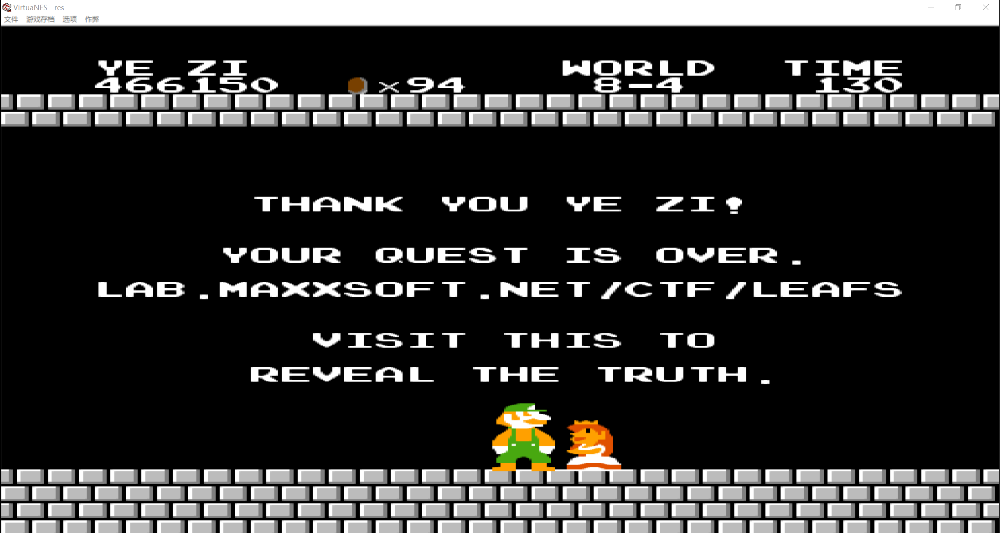
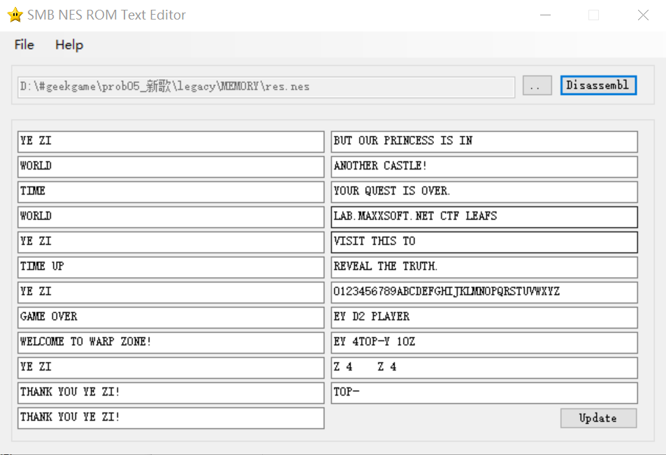
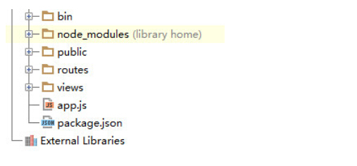
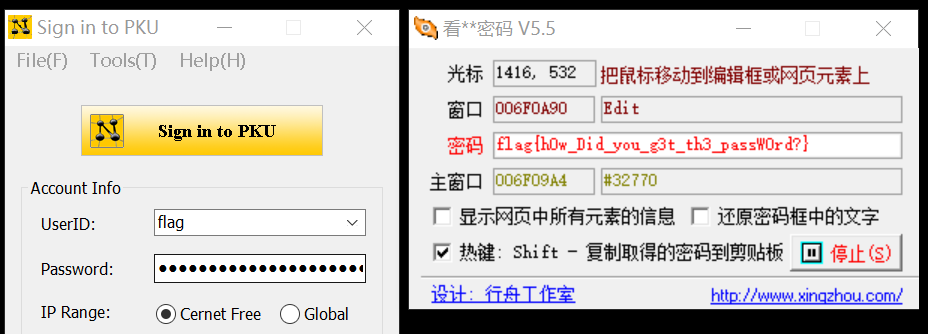

第零届北京大学信息安全综合能力竞赛（PKU GeekGame）的Writeup，题目及官方题解：[geekgame-1st](https://github.com/PKU-GeekGame/geekgame-1st)。

## 签到

这不是巧了吗，前段时间做Puzzle hunt刚见过wingdings。不过这道题也不用手动翻译，是字符串加了字体而不是图片格式，直接 Ctrl A + Ctrl C + Ctrl V 到 txt 即可。得到两行字符，轮流读取得到flag。


## 小北问答

1. > 北京大学燕园校区有理科 1 号楼到理科 X 号楼，但没有理科 (X+1) 号及之后的楼。X 是？

   根据经验，X=5。

2. > 上一届（第零届）比赛的总注册人数有多少？

   https://news.pku.edu.cn/xwzh/203d197d93c245a1aec23626bb43d464.htm

3. > geekgame.pku.edu.cn 的 HTTPS 证书曾有一次忘记续期了，发生过期的时间是

   在 https://crt.sh/ 上查geekgame的域名，发现2021-07-11有过一次过期，可以看到具体时间。

4. > 2020 年 DEFCON CTF 资格赛签到题的 flag 是？

   在 https://oooverflow.io/dc-ctf-2020-quals/ 的计分板上找到签到题的名字是welcome-to-dc2020-quals，再按这个名字搜索找到题目页面 https://archive.ooo/c/welcome-to-dc2020-quals/358/。

5. > 在大小为 672328094 * 386900246 的方形棋盘上放 3 枚（相同的）皇后且它们互不攻击，有几种方法？

   http://oeis.org/A047659

   这道题被坑了好久……本来找到了OEIS的页面，结果只看到正方形棋盘的公式没看到下面就有长方形棋盘的扩展公式，看了提示才找到orz。不过发现了Kotesovec的一本书 *non attacking chess pieces 2013 6ed* 还挺有意思的。

6. > 上一届（第零届）比赛的“小北问答1202”题目会把所有选手提交的答案存到 SQLite 数据库的一个表中，这个表名叫？

   https://github.com/PKU-GeekGame/geekgame-0th/blob/main/src/choice/game/db.py 

   查看上届比赛的存档代码即可。

7. > 国际互联网由许多个自治系统（AS）组成。北京大学有一个自己的自治系统，它的编号是？

   https://ipinfo.io/AS59201

   直接Google "peking university asn" 查到两个，AS24349是第二代中国教育网在北大的节点，AS59201才是北大自己的。

8. > 截止到 2021 年 6 月 1 日，完全由北京大学信息科学技术学院下属的中文名称最长的实验室叫？ 

   https://eecs.pku.edu.cn/info/1060/10794.htm

   查信科官网即可，需要人工断句略坑。


## 共享的机器

1. https://ropsten.etherscan.io/ 上可以查到Contract机器码

2. 拿到 https://ethervm.io/decompile/ 上反汇编（直接输入地址反汇编）

3. 解析程序逻辑：

   如果是creator，调用第一个函数存储storage[2]，storage[3]

   如果是用户，调用第二个函数，做一堆位运算验证 flag

4. 在 https://ropsten.etherscan.io 上找到一条 [internal transaction](https://ropsten.etherscan.io/tx/0x26c021f066afcd313150ca57bfe828b47f93c4986297b201e4dff02c525a9b2e#statechange)，进去看state，发现storage的值。

4. 有了storage即可逆运算解出flag，参考Solidity的[语法](https://solidity.tryblockchain.org/index.html)和[运算符优先级](https://blog.csdn.net/qq_33829547/article/details/80418871)，需要稍微注意一下Solidity的运算符优先级和其他语言都不太一样。

   

```python
st2 = 0x15eea4b2551f0c96d02a5d62f84cac8112690d68c47b16814e221b8a37d6c4d3
st3 = 0x293edea661635aabcd6deba615ab813a7610c1cfb9efb31ccc5224c0e4b37372
flag = 0
for i in range(64):
    tmp1 = (st2>>(4*i))*7 + 5*i
    tmp2 = st3>>(4*i)
    for x in range(16):
        if ((x+tmp1)&0x0f) == (tmp2&0x0f):
            flag += (x<<(4*i))
print(bytes.fromhex(hex(flag)[2:]))
```

几行代码直接贴在这里了。这道题做法很简单，但是入门区块链费了好多时间，etherscan网站自带的反汇编结果还是错的……


## 翻车的谜语人

~~上届比赛命题人说要出pcap寻宝和古典密码，真是说到做到~~

先在WinHex里搜一下flag1和flag2，发现几段python代码，生成和加密flag并且写入文件，是用jupyter写的。

把数据丢进Wireshark里，导出http对象，果然发现了Untitled.ipynb和flag1.txt。python里就是随机生成key并对flag做异或运算，直接用给出的key再异或一次就得到flag1。

此外，http对象里还有一个flag.7z，但是导出后发现有密码。提示说要找You酱具体干了什么，于是继续翻pcap，过滤掉大概率无用的DLTS传输文件，发现WebSocket协议传输了一些stdin和stdout的数据，解析出来是几个bash命令：

```bash
> pip3 install stego-lsb
> stegolsb wavsteg -h -i ki-ringtrain.wav -s flag2.txt -o flag2.wav -n 1
Using 1 LSBs, we can hide 297712 bytes
> 7za a flag2.7z flag2.wav -p"Wakarimasu! `date` `uname -nom` `nproc`"
```

很明显是用stego-lsb这个库把flag2隐写在wav里了，然后加密压缩。只要把反引号内的命令替换成结果即可，从WebSocket里挖出另外几条线索：

```bash
# 用户名：
root@you-kali-vm:~/course/geekgame
# 7z版本号：
7-Zip (a) [64] 16.02 : Copyright (c) 1999-2016 Igor Pavlov : 2016-05-21\r\np7zip Version 16.02 (locale=en_US.utf8,Utf16=on,HugeFiles=on,64 bits,8 CPUs Intel(R) Core(TM) i7-10510U CPU @ 1.80GHz (806EC),ASM,AES-NI)
# 敲下回车的时间：
Nov  6, 2021 15:44:15.149503000 中国标准时间
```

综合以上信息，得到解压密码：

（date这个命令的格式试了好多次，最后直接搜kali Linux date才找到正确格式）

```
date: Sat 06 Nov 2021 03:44:15 PM CST
uname -n: you-kali-vm
uname-o: x86_64
uname-m: GNU/Linux
nproc: 8
password: Wakarimasu! Sat 06 Nov 2021 03:44:15 PM CST you-kali-vm x86_64 GNU/Linux 8
```

然后用stego-lsb解密：

```bash
stegolsb wavsteg -r -i flag2.wav -o flag2.txt
```

在pcap里挖到两个Untitled.ipynb，有两个不同的key值。但是注意到flag2和flag1的首尾一样，所以用的是同一个key。同上解密得到flag2。


## 叶子的新歌

只找到了第三个flag。

开场查metadata，得到一个base64加密的字符串，解密得到网址http://lab.maxxsoft.net/ctf/legacy.tbz2 。下载的tbz2文件直接解压，得到MEMORY.ZIP和一个密码备忘文件。搜索这些字符发现是第五套人民币的冠字号，解密为20位数字：

```
宾驭令诠怀驭榕喆艺艺宾庚艺怀喆晾令喆晾怀
72364209117514983984
```

解压之后是一个软盘映像img文件，里面有left.bin和right.bin，根据提示找不同，逐字节对照两个文件，得到差异的数据，代码在`叶子的新歌_找不同.ipynb`。对比[二进制文件头](https://blog.mythsman.com/post/5d301940976abc05b345469f/)发现是NES文件，与提示里的红白机对上了。下载一个VirtuaNES软件，发现这个NES是超级马里奥，且标题文本被修改，容易猜到要通关游戏才能到下一步。这里有两种做法：

1. 正常玩到通关，可以在模拟器里开个金手指，例如079F-01-09（金身无敌）

   

2. 找个能修改超级马里奥文本的工具（例如smbnesromtexteditor），直接看里面的文字（其实是玩通关之后卡住了才发现了这个方法）

   

总之进入最后一步，网址要求输入“软盘启动后的密码”，这里卡了很久，没想到软盘挂到虚拟机上能出现新的信息，看了提示才做出来。


## 在线解压网站

网站是用flask写的，先审计一下程序逻辑：

1. route('/')：当用户点击提交时，先清空/dev/shm/zip/media/*，然后把文件存为tmp.zip，解压在当前文件夹里，并立即删掉tmp.zip。
2. route('/media/\<path>')：若path不是文件夹，则直接下载文件；若path是文件夹，则重新渲染template.html，列出各个子文件的目录。

题目里说功能不完整，上传一个多层压缩包之后发现只能进到第二层。搜索flask的路由参数，发现是因为代码中指定的path是默认string类型，不能含有'/'，因此也无法穿越到上层路径。此外也试过flask的模板注入漏洞，但是程序中并没有用到render_template_string()函数，因此也不可行。

最后想到了软链接的方法，参考网上的[博客](https://blog.csdn.net/keyball123/article/details/105169946/)构造软链接生成压缩包，拿到flag。

```bash
ln -s /flag flag
zip --symlinks test.zip flag
```


## Flag即服务

flag0：看了提示之后去查了node.js的源码目录结构，目标应该是上一层文件夹里的package.json，从浏览器的调试模式重新发送请求 https://prob11-vluaa5z4.geekgame.pku.edu.cn/api/..%2fpackage.json，拿到了源码的压缩包，根据最后一段代码直接得到flag1=\`flag{${0.1+0.2}}\`=flag{0.30000000000000004}。




## 诡异的网关

大概是非预期解……去网上一搜发现有peekPassword这种工具，试了一下直接就看到密码了。




## 密码学实践

纯算法题，老老实实读代码：

1. 上帝负责签发证书：输入名字和密码，上帝把它们打包用RSA加密，N和e是公开的。
2. Richard手里有flag：他所用的MESenc方法实质上是将信息切片，每32字节都用同样的方式循环移位异或加密。他先发送了加密的flag1，然后需要给他Alice的证书，才能拿到flag2。

那么先看flag1，因为每32字节都是用相同的密钥做异或，由于异或运算的可交换性，明文、密文、密钥知道任何两个都能推出第三个。先推导一下三者的关系：

```python
keys = [set(['k%d'%i]) for i in range(32)]
a, b, c, d = set(['a0']), set(['b0']), set(['c0']), set(['d0'])
for i in range(32):
    a, b, c, d = b, c, d, a^c^keys[i] 
print("a=%s\nb=%s\nc=%s\nd=%s"%(a,b,c,d))

> a={'k22', 'k8', 'k26', 'k14', 'k4', 'k20', 'k10', 'k28', 'k16', 'c0', 'k2'}
> b={'k15', 'k9', 'k5', 'k29', 'k21', 'k17', 'k23', 'k3', 'd0', 'k11', 'k27'}
> c={'k22', 'k0', 'k6', 'k30', 'k12', 'k4', 'k10', 'k28', 'k16', 'c0', 'k18', 'k24', 'a0'}
> d={'k5', 'k13', 'k19', 'k29', 'k25', 'b0', 'k17', 'k11', 'd0', 'k31', 'k7', 'k23', 'k1'}
```

于是可以用前32字节的明文和密文推出密钥，再用后面的密钥和密文推出明文。

对于flag2，我们需要给Richard一个名字是Alice的证书，但是Alice的名字已经被占用了。这里的RSA密钥位数太高，不可能暴力破解，但是上帝可以替我们进行几次加密。根据RSA的原理，容易想到构造两个证书，使其明文x和y满足：$x\cdot y \equiv \ 'Alice'\mod N$，这样他们密文的乘积模N也与Alice的证书相同。

仔细观察证书明文的结构（如下所示）和Richard解读证书的方法，发现两个关键点：

1. Richard不关心Alice的key，只要名字相同即可；
2. Richard做完RSA解码之后读出名字的逻辑，是先读出末两字节（key的长度），再倒推到key之前的两字节（name）的长度，然后按长度读取name，并且忽略掉前面的字节。

| name                   | len(name) | key      | len(key) |
| ---------------------- | --------- | -------- | -------- |
| 0x416c696365 (‘Alice’) | 0x0005    | whatever | 0x....   |

由于上帝和Richard都不关心key的具体内容，我们可以按下面的方式来构造，使得打包之后的数字尽可能简单：

|      | name                | len(name) | key  | len(key) |
| ---- | ------------------- | --------- | ---- | -------- |
| x    | 0x....              | 0x0002    | 0x00 | 0x0001   |
| y    | 0x......            | 0x0003    | 0x00 | 0x0001   |
| x*y  | 0x.......416c696365 | 0x0005    | 0x00 | 0x0001   |

这样构造key时，x和y的长度需要满足和为5，以及乘积的name域末尾是Alice。在这种限制下暴力搜索的范围并不大。先尝试了长度分别为1和4的情况无解，而长度为2和3的时候解出`x=0x86a2, y=0x68d6c3`。分别以这两个名字和`0x00`作为key向上帝申请证书，乘起来交给Richard即可骗到flag2。虽然他在送出flag2时对key进行了一大堆操作，但是按上面相同的方法，用已知明文攻击可以破解出flag2。具体的代码放在`密码学实践.ipynb`。
