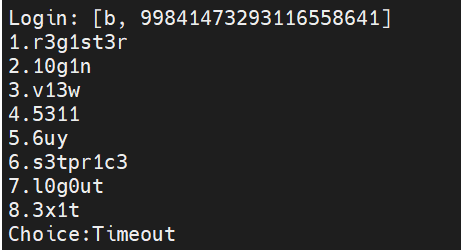
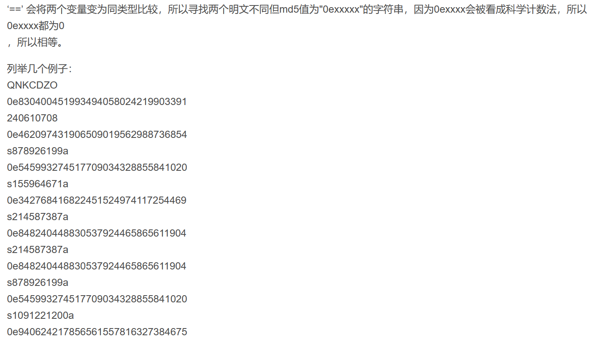

快乐摸鱼！


### flag market (Crypto)

题目源码：[task1.py](./flag market/task1.py), [task2.py](./flag market/task2.py), [task3.py](./flag market/task3.py)

题解：[flagmarket1.py](./flag market/flagmarket1.py), [flagmarket2.py](./flag market/flagmarket2.py)

题目是一个flag市场，目标是从admin用户手上买到价值`0x233333333333`的flag。



#### task 1

* 审计源码，新注册的账号只有100元，而只有拥有flag才能用view查看内容。因此有两种思路，一是用admin账户登录进去，二是新建账户买下flag。
* 对于方案一，不能用admin注册，而由于admin没有初始资金，也不能用admin登录。没有后门能实现这一点。
* 对于方案二，从buy函数没找到漏洞，似乎不能白嫖flag，那就只能想办法赚钱了。发现sell函数允许凭空出售物品，限制`price < 100`却没有限制`price > 0`！
* 于是找到漏洞和破解方案：
  * 创建一个账户a，把一个价值为`-1e20`的flag放进市场
  * 创建账户b，买下这个flag，于是有钱可以买下真flag
  * 用view功能查看flag内容，要求输入(user,command)的RSA签名，虽然我们不知道，但是服务器会自动打印出来。因此重复两次，第二次输入第一次拿到的签名，成功拿到flag。

#### task 2

* 新的程序修补了出售负价格商品的漏洞，却没有改setprice函数，所以方案和之前基本相同。难点在于setprice需要校验(user,price)的签名，可是我们能白嫖到的只有各种(user,command)的签名——仔细一看，sell的command居然是**5311**纯数字！这下loot玩脱了，可以通过设计账户名来白嫖签名，具体方案如下：
  * 创建一个账户`a-10000000000000000000`，把一个普通价格的普通flag放进市场，并且拿到执行sell命令的签名：`RSA("a-1000000000000000","5311")`
  * 创建账户`a`，把这个普通flag买下来，然后修改价格为`-10000000000000005311`，所需的校验码`RSA("a","-10000000000000005311")`和上一步拿到的相同，顺利执行命令
  * 接下来和task1相同，用新的账户买下这个倒贴钱的flag，发财之后买下真flag即可。

#### task 3

* 新的程序修复了flag倒贴钱的bug，但是可以通过新账户购买fakeflag的方式给admin钱，使得我们可以登录到admin账户。此时仍然有两种思路：用admin账户查看flag，或是用admin账户调低价格将其卖出。但是两者都需要通过RSA校验，且签名时将用户名排除在外，无法取巧，应该要用硬核方法破解RSA了。
* 方案一需要的签名：`RSA("getflag")`，方案二需要的签名：`RSA(str(price))`
* 已知的信息：模数N，解密指数e，以及几种命令对应的密文，找不到切入点……


### What is $? (Web)

题目源码：[code.php](./what is $/code.php)
题解：[php.ipynb](./what is $/php.ipynb)

#### task1

审计php源码，首先定位flag出现的位置，发现需要满足很多个条件：

```php
// 条件1
((!isset($_GET['action']) || ($_GET['action'] == 'login' && (!isset($_POST['cb_user']) || !isset($_POST['cb_pass'])))) == false

// 条件2
($_GET['action'] == 'login' && $_POST['cb_user'] == 'admin' && $_SERVER['REMOTE_ADDR'] != '127.0.0.1') == false

// 条件3
$_REQUEST['action'] == 'login'

// 条件4
($_POST['cb_user'] == 'admin' && !preg_match('/a/si', $_POST['cb_pass']) && md5($_POST['cb_pass']) == md5($_POST['cb_salt'].'a')) == true
```

具体解析以上条件，只要设置合适的GET和POST请求内容即可成功，但是条件2和3中的action一项冲突。

* 思路一，绕开`REMOTE_ADDR`，但是无法通过请求头里的`X-Forwared-For`和`Client-IP`伪造。输入无效url时发现服务器版本是`Apache/2.4.38`，搜到了该版本存在一个[SSRF漏洞](https://github.com/vulhub/vulhub/blob/master/httpd/CVE-2021-40438/README.zh-cn.md)，可惜服务器上没有开启相应的转发协议。

* 思路二，反复阅读代码发现条件2是GET而条件3是REQUEST，后者的数据来源于**GET和POST的并集**！因此可以利用POST输入action参数，同时满足这两个条件。

* 至于条件4，需要满足cb_pass不包含字母a，却与cb_salt+”a“的md5相同。提示是”==“，与php是弱类型语言有关，简单搜索[相关资料](https://blog.csdn.net/qq_37410729/article/details/109552822)，即可找到满足条件的字符串：

  

* 综上，构造payload如下：

  ```json
  GET: {"action": "AnythingExceptLogin"}
  POST: {"action":"login", "cb_user":"admin", "cb_pass":"QNKCDZO", "cb_salt":"s155964671"}
  ```

#### task 2

```php
// autoload函数，自动载入新出现的库
function autoload($class) {
    @include_once(__DIR__.'/'.strtolower(str_replace('\\', '/', $class)).'.php');
}
spl_autoload_register('autoload');

// 这里lib\Flag会触发autoload函数，传参$class="lib\Flag"
die(lib\Flag::FLAG1);
```

提示是flag2与flag1在相同的地方，根据autoload和调用flag的方式可以解析出实际上include的文件：`__DIR__/lib/flag.php`，那么目标就是读取出这个文件的内容。

再次审计源码，用task1的方法登录成功后，解锁了save_item和list_item的新功能。前者可以保存任意内容的文件，后者从数据库中列举已保存的文件。这里涉及到SQL插入和查询，结合提示，很容易想到SQL注入攻击。

```php
// SQL相关的关键代码
// in case 'save_item':
	$item_filename = 'up/'.substr(md5($item_name),0,4).'.php';

	if (!preg_match('/^[a-zA-Z0-9]*$/', $item_name) || !preg_match('/^\S{8}-\S{27}$/', $item_uuid))
        die('blanket and special characters is not allowed in item name or uuid is invalid');

	if ($db->query("INSERT INTO items (`name`, `uuid`, `filename`) VALUES ('$item_name', '$item_uuid', '$item_filename')"))
        @file_put_contents($item_filename, $item_content);

// in case 'list_item':
    $res = $db->query("SELECT * FROM items");
        
    echo 'Content: '.file_get_contents($row['filename']).'<br/>';
```

当执行list_item时，程序取出数据库内的 **filename**，并直接输出该文件的内容，所以只要将其篡改为我们想要的目录就成功了。考虑save_item中的insert操作，有三个字符串都是我们输入的：name被严格限制只能用数字和字母，uuid只要满足长度和非空限制，filename是利用md5自动生成的，那么自然是魔改限制最少的uuid。

```sql
# 原始SQL语句：
INSERT INTO items (`name`, `uuid`, `filename`) VALUES ('$item_name', '$item_uuid', '$item_filename')

# SQL注入的目标：
INSERT INTO items (`name`, `uuid`, `filename`) VALUES ('$item_name', '$item_uuid', 'lib/flag.php')

# 令name = "whatever", uuid = "xxxxxxxx-','lib/flag.php')#xxxxxxxxx"
# SQL注入的效果：
INSERT INTO items (`name`, `uuid`, `filename`) VALUES ('whatever', 'xxxxxxxx-','lib/flag.php')#xxxxxxxx', '$item_filename')
```

简单的SQL注入即可完成目标，读取出flag.php：

```php
<?php
namespace lib;

class Flag {
    const FLAG1 = 'flag{simple_php_bypass_f4ffbe58}';
    const FLAG2 = 'flag{simple_sql_injection_41278e35}';
    // FLAG3 is in /flag3, call /readflag3 to read it;
}
```

这道题遇到的最大难点是嵌套字典怎么用python传参……被坑了好久才试出来：

```python
post_dict = {"item[name]": 1, "item[uuid]": uuid, "item[content]": "whatever"}
```

#### task 3

不知道有没有用的资料：[phar反序列化漏洞](https://i.blackhat.com/us-18/Thu-August-9/us-18-Thomas-Its-A-PHP-Unserialization-Vulnerability-Jim-But-Not-As-We-Know-It.pdf)


### babystack_level0 (pwn)

题目是一个elf文件，直接用IDA反汇编：

```c++
int run(void)
{
  char s1[112]; // [rsp+0h] [rbp-70h] BYREF

  puts("Welcome to THUCTF2022");
  puts("Just tell me your wish:");
  read_in(s1);
  if ( !strcmp(s1, "F14g") )
    flag(); // 并不能给出flag
  return puts("Bye");
}

// 目标函数，起始地址为0x00000000004006C7
int back(void)
{
  return execve("/bin/sh", 0LL, 0LL);
}
```

主函数的strcmp函数有栈溢出漏洞，根据IDA解析出的内容，s1在栈中的地址离rbp的距离为0x70，rbp后面就是返回地址，因此注入0x78字节的垃圾数据和后门back函数的地址，注入以上内容即可弹入shell，在根目录下找到flag文件即可。
